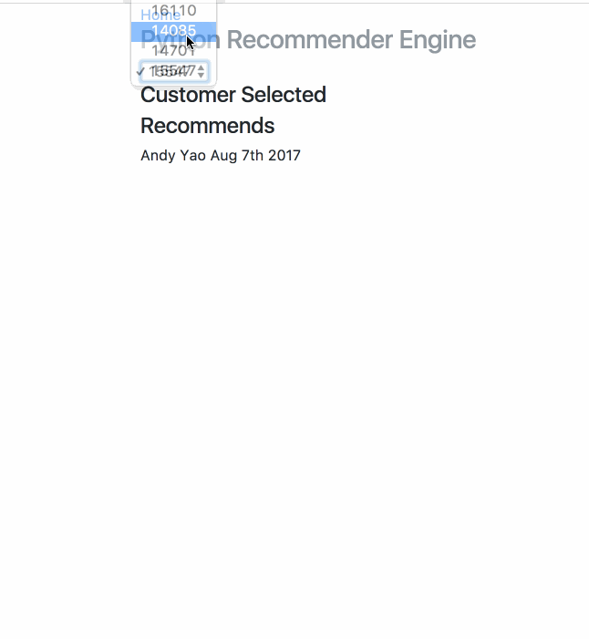

# Python Recommender App

This is a recommender system that uses a customer's purchase history to recommend items to them.

You can select the customer based on their customer ID. The first table is what they have purchased base on purchase quantity, and the second table is what the recommender outputs. 




## Getting Started

TBA

### Prerequisites

see requirements.txt 

pandas

flask

implicit 


```python
pip install -r requirements.txt
```

### Installing

TBA


## Guides / References

[How to set up flask on AWS](http://amunategui.github.io/idea-to-pitch/#installing-flask)
[Collaborative Filtering for - Hu, Koren, Volinsky](http://yifanhu.net/PUB/cf.pdf)
[A Gentle Introduction to Recommender Systems with Implicit Feedback](https://jessesw.com/Rec-System/)